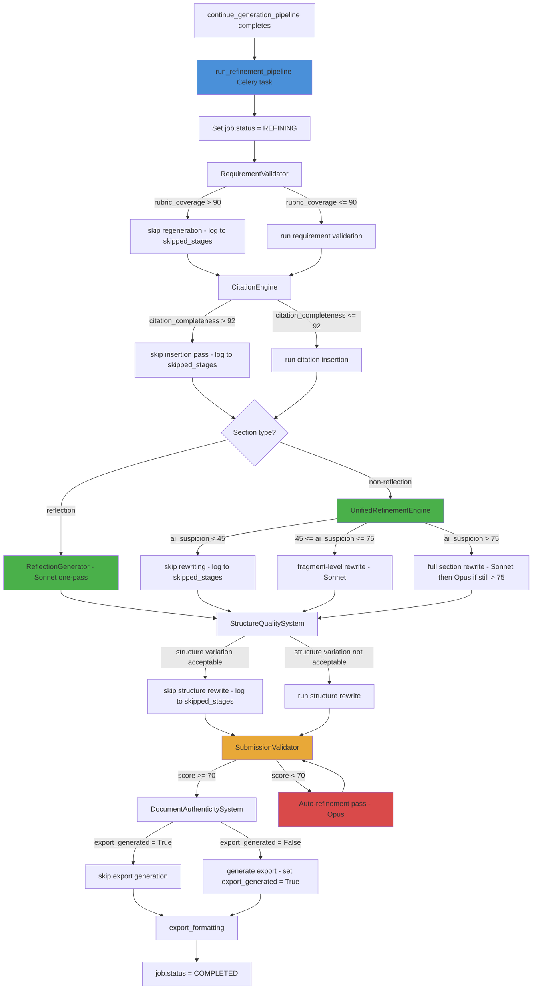

# Design Document: Academic Refinement Pipeline

## Overview

The Academic Refinement Pipeline is a post-generation processing system that transforms LamGen's raw AI-generated assignment content into submission-ready academic documents. It inserts a sequence of automated passes between the existing `section_generation` stage (Stage 6) and `export_formatting` (Stage 10) in the Celery pipeline.

The pipeline is triggered automatically when `continue_generation_pipeline` completes, via a new `run_refinement_pipeline` Celery task. It operates on the `GeneratedSection` records already persisted to the database, applying six processing systems in sequence: `RequirementValidator`, `CitationEngine`, `ReflectionGenerator` (reflection sections only), `UnifiedRefinementEngine` (non-reflection sections), `StructureQualitySystem`, `SubmissionValidator`, and `DocumentAuthenticitySystem`.

The consolidated architecture replaces the original three separate engines (`HumanizationEngine`, `RealismEngine`, `AIDetectionDefenseLayer`) with a single `UnifiedRefinementEngine` that performs one combined pass per section or fragment. A `StaticAnalyser` utility class provides deterministic pure-Python analysis with zero LLM calls, used by all stages before deciding whether to invoke an LLM. An `AnalysisCache` utility caches expensive analysis results by content hash to avoid redundant computation on retries. A `ReflectionGenerator` handles reflection sections in a single Sonnet pass with realism-first prompting.

The design extends the existing Django/Celery architecture with minimal surface area: one new Celery task, one new Django model (`RefinementResult`), two new fields on `GeneratedSection`, one new `GenerationJob.Status` choice, extended `AssignmentBrief.AssignmentType` choices, a `model_override` parameter on `ClaudeService`, and new service classes under `generation/services/refinement/`.

### Design Goals

- Zero manual editing required before submission in the majority of cases
- Dramatically reduced token cost: target $0.80–$3.00 per assignment (down from $4–$10)
- Fragment-level rewriting: only risky fragments are rewritten, not entire sections
- Threshold-based skipping: stages are skipped automatically when quality thresholds are already met
- Deterministic validation: `StaticAnalyser` replaces LLM calls for all measurable text properties
- Cost-effective model routing: Haiku for scanning, Sonnet for standard passes, Opus only as last resort when Sonnet pass still scores > 75
- Graceful degradation: budget exhaustion or stage failure proceeds to export with best available content
- Full observability: every API call logged to `TokenUsageLog`, all quality scores and costs persisted to `RefinementResult`
- Monotonic progress reporting via the existing `GenerationPipelineOrchestrator`

---

## Architecture

The pipeline follows the same service-per-stage pattern established by the existing generation pipeline. Each refinement system is a standalone service class that receives a `GenerationJob`, its associated `AssignmentBrief`, and the list of `GeneratedSection` objects, and returns updated sections plus quality scores.



### Stage Weights (extended orchestrator)

| Stage | Progress % |
|---|---|
| `section_generation` | 60% |
| `requirement_validation` | 65% |
| `citation_validation` | 72% |
| `unified_refinement` | 80% |
| `structure_quality` | 87% |
| `submission_validation` | 93% |
| `auto_refinement` | 97% |
| `export_formatting` | 100% |

### Model Routing

| Task | Model |
|---|---|
| AI pattern scanning, citation format detection, word count analysis, structural uniformity detection, scoring, analytics, lightweight validation, classification | Haiku |
| Citation insertion/formatting, standard humanization (non-high-risk), auto-regeneration from RequirementValidator, reflection generation, standard unified refinement, realism enhancement, fragment-level rewrites | Sonnet |
| High-risk section rewrites ONLY when Sonnet pass still scores > 75, ONLY final auto-refinement triggered by score < 70, ONLY difficult reflective rewriting, ONLY rubric failure recovery | Opus |
| Scanning, validation, basic humanization, formatting, simple rewrites | NEVER Opus |

**Key routing change from original design:** Opus is now a last resort, not the default for high-risk sections. Sonnet handles all high-risk sections first; Opus is only invoked if the Sonnet pass still produces an AI_Suspicion_Score above 75.

### Budget Priority Order

When the remaining token budget is insufficient to complete all stages, stages are executed in this priority order and skipped if budget is exhausted:

1. Requirement_Validator
2. Citation_Engine
3. UnifiedRefinementEngine / ReflectionGenerator
4. Structure_Quality_System

---

## Components and Interfaces

### New Celery Task: `run_refinement_pipeline`

```python
# generation/tasks.py

@shared_task
def run_refinement_pipeline(job_id: str) -> None:
    """
    Execute the Academic Refinement Pipeline after section generation.
    Triggered automatically by continue_generation_pipeline on completion.
    """
```

The task follows the same error-handling pattern as `continue_generation_pipeline`: any unhandled exception calls `orchestrator.fail_job(job, stage, error)` and returns.

### Service Directory Structure

```
generation/services/refinement/
    __init__.py
    static_analyser.py          # deterministic pure-Python analysis, zero LLM calls
    analysis_cache.py           # Django-cache-backed result caching
    reflection_generator.py     # one-pass Sonnet generation for reflection sections
    unified_refinement_engine.py  # merged humanization + realism + AI-defense
    citation_engine.py
    requirement_validator.py
    structure_quality_system.py
    submission_validator.py
    document_authenticity.py
    pipeline_runner.py          # coordinates all services in new order
```

### `RefinementPipelineRunner`

Central coordinator that holds references to all service instances and executes them in the updated order, managing budget checks and threshold-based skipping between stages.

```python
class RefinementPipelineRunner:
    def run(self, job: GenerationJob) -> RefinementResult:
        """
        Execute all refinement stages in order:
        RequirementValidator → CitationEngine →
        ReflectionGenerator (reflection sections only) →
        UnifiedRefinementEngine (non-reflection sections) →
        StructureQualitySystem → SubmissionValidator → DocumentAuthenticitySystem
        Returns the persisted RefinementResult.
        """
```

### `StaticAnalyser`

Pure-Python utility class with zero LLM calls. Used by all pipeline stages before deciding whether to invoke an LLM.

```python
class StaticAnalyser:
    AI_SIGNATURE_PHRASES: list[str]       # class-level constant
    MACHINE_CONFIDENCE_PHRASES: list[str]  # class-level constant

    def count_words(self, text: str) -> int: ...
    def paragraph_word_counts(self, text: str) -> list[int]: ...
    def paragraph_opening_words(self, text: str) -> list[str]: ...
    def sentence_lengths(self, text: str) -> list[int]: ...
    def detect_ai_signature_phrases(self, text: str) -> list[str]: ...
    def detect_machine_confidence_phrases(self, text: str) -> list[str]: ...
    def detect_transition_density(self, text: str) -> float: ...
    def detect_analytical_verb_frequency(self, text: str, window: int = 500) -> dict[str, int]: ...
    def detect_repetitive_sentence_openings(self, text: str) -> float: ...
    def detect_paragraph_length_uniformity(self, text: str) -> float: ...
    def validate_doi_format(self, doi: str) -> bool: ...
    def validate_citation_format(self, citation: str, style: str) -> bool: ...
    def validate_reference_list_order(self, references: list[str], style: str) -> bool: ...
    def compute_ai_suspicion_score(self, text: str) -> float: ...
    def compute_human_realism_score(self, text: str) -> float: ...
```

All fifteen methods use only Python standard library operations (string manipulation, `re`, `statistics`). No LLM calls are made from any method.

### `AnalysisCache`

Django-cache-backed utility for caching expensive analysis results by content hash.

```python
class AnalysisCache:
    TTL_SECONDS: int = 3600

    def _make_key(self, job_id: str, content: str, analysis_type: str) -> str:
        """Returns 'refinement:{job_id}:{md5_16}:{analysis_type}'"""

    def get_or_compute(
        self,
        key: str,
        compute_fn: callable,
        ttl: int = 3600,
    ):
        """
        Return cached result on hit (log DEBUG cache hit).
        On miss: call compute_fn(), store result with ttl, return result.
        """
```

Cached analysis types: rubric extraction, assignment requirement parsing, framework extraction, section structure analysis, static analysis scores per section.

### `ReflectionGenerator`

Dedicated service for reflection sections. Performs one-pass generation with realism-first prompting using Sonnet. Never uses Opus.

```python
class ReflectionGenerator:
    def process(
        self,
        sections: list[GeneratedSection],
        brief: AssignmentBrief,
        job: GenerationJob,
    ) -> list[GeneratedSection]:
        """
        Generate or refine reflection sections in a single Sonnet pass.
        Prompt includes: natural uncertainty markers, personal reasoning simulation,
        controlled inconsistency, reduced philosophical tone.
        Sections processed here are NOT passed to UnifiedRefinementEngine.
        """
```

Reflection prompt characteristics:
- Realism-first: natural imperfection is built into the generation prompt, not applied as a post-processing pass
- Includes uncertainty markers: "I found that", "this challenged my assumption that", "I was not entirely sure"
- Personal reasoning moments at ≥1 per 200 words
- Reduced philosophical tone
- Uses `model_override='sonnet'` exclusively

### `UnifiedRefinementEngine`

Replaces `HumanizationEngine`, `RealismEngine`, and `AIDetectionDefenseLayer`. Performs one combined pass per section or fragment.

```python
class UnifiedRefinementEngine:
    def process(
        self,
        sections: list[GeneratedSection],
        brief: AssignmentBrief,
        job: GenerationJob,
    ) -> list[GeneratedSection]:
        """
        For each non-reflection section:
        1. Use StaticAnalyser to detect all issues (zero LLM calls)
        2. Apply threshold checks: skip if ai_suspicion < 45 or realism_score > 80
        3. If rewriting needed: fragment-level if score <= 75, full section if score > 75
        4. Single LLM call with diff-based prompt: humanize + realism + AI-defense simultaneously
        5. If Sonnet pass still scores > 75: second pass with Opus
        6. Log skipped stages to RefinementResult.skipped_stages
        """

    def _build_diff_prompt(
        self,
        section_content: str,
        issues_list: list[str],
        fragments: list[str],
    ) -> str:
        """
        Returns a constrained editing prompt:
        'Modify ONLY the following detected issues...'
        Never uses open-ended 'rewrite naturally' instructions.
        """
```

Diff-based prompt format:
```
Modify ONLY the following detected issues in the text below:
{issues_list}

Preserve exactly:
- All factual claims and citations
- Document structure and section order
- Rubric-aligned analytical content
- Word count within ±10%

Issues to fix:
{specific_fragments_with_line_references}

Text:
{section_content}
```

Context window optimisation:
- Receives only the section(s) it needs, not the full assignment
- For fragment-level rewriting: receives only the risky fragments, not full sections
- For structure engine: receives lightweight metadata summary (paragraph counts, word counts), not full content

The old `HumanizationEngine`, `RealismEngine`, and `AIDetectionDefenseLayer` classes become thin wrappers delegating to `UnifiedRefinementEngine`, or are removed.

### `CitationEngine`

```python
class CitationEngine:
    SUPPORTED_STYLES = {'Harvard', 'APA', 'Chicago', 'MLA'}

    def process(
        self,
        sections: list[GeneratedSection],
        brief: AssignmentBrief,
        job: GenerationJob,
    ) -> tuple[list[GeneratedSection], float]:
        """
        Use StaticAnalyser for format validation and DOI checking.
        Skip citation insertion pass if citation_completeness > 92 (threshold skip).
        Identify uncited claims, insert citations, validate reference list,
        detect hallucinations. Returns updated sections and citation_completeness_score.
        """
```

Hallucination detection checks:
- DOI format: `StaticAnalyser.validate_doi_format()` — must match `10\.\d{4,}/\S+`
- Journal names: validated against known academic publisher pattern list
- Author-year mismatches within the same reference
- URLs: must resolve to a plausible academic domain (`.edu`, `.ac.uk`, `.org`, known publisher domains)

Context window optimisation: receives only citation-relevant chunks (section content + reference list), not the full assignment.

### `RequirementValidator`

```python
class RequirementValidator:
    def process(
        self,
        sections: list[GeneratedSection],
        brief: AssignmentBrief,
        job: GenerationJob,
    ) -> tuple[list[GeneratedSection], float, dict]:
        """
        Skip requirement regeneration if rubric_coverage > 90 (threshold skip).
        Validate content against brief and rubric.
        Triggers auto-regeneration via Sonnet for failing criteria.
        Returns updated sections, rubric_coverage_score, and validation_report dict.
        """
```

Validation report schema:
```json
{
  "rubric_coverage": {"criterion_name": 0.0},
  "missing_sections": ["section_title"],
  "word_count_compliant": true,
  "framework_references": {"NIST": true, "ISO 27001": false},
  "rubric_coverage_score": 0.0
}
```

Assignment-type-specific checks:
- `reflection`: first-person language present
- `case_study`: organisational context referenced
- `policy_analysis`: policy recommendation section and stakeholder analysis present
- `dissertation`: doctoral-level tone enforced

### `StructureQualitySystem`

```python
class StructureQualitySystem:
    def process(
        self,
        sections: list[GeneratedSection],
        brief: AssignmentBrief,
        job: GenerationJob,
    ) -> list[GeneratedSection]:
        """
        Use StaticAnalyser for detection (paragraph counts, word counts).
        Skip structure rewrite if variation already acceptable (threshold skip).
        Enforce structural variation: paragraph length diversity,
        section paragraph count variation, rhetorical structure distribution.
        Receives lightweight metadata summary, not full content, for detection phase.
        """
```

### `SubmissionValidator`

```python
class SubmissionValidator:
    SCORE_WEIGHTS = {
        'ai_suspicion_inverted': 0.25,
        'rubric_coverage': 0.25,
        'citation_completeness': 0.20,
        'human_realism': 0.15,
        'word_count_compliance': 0.15,
    }
    TIMEOUT_SECONDS = 300

    def process(
        self,
        sections: list[GeneratedSection],
        brief: AssignmentBrief,
        job: GenerationJob,
        scores: dict,
    ) -> RefinementResult:
        """
        Use StaticAnalyser for final audit scores.
        Run final audit, compute Submission_Readiness_Score, trigger auto-refinement
        if score < 70 or AI_Suspicion_Score > 65. Persist and return RefinementResult.
        Track cost fields: total_refinement_cost_usd, cost_breakdown, llm_calls_count,
        static_analysis_calls_count, cache_hit_count, skipped_stages.
        """
```

### `DocumentAuthenticitySystem`

```python
class DocumentAuthenticitySystem:
    def process(
        self,
        sections: list[GeneratedSection],
        brief: AssignmentBrief,
        job: GenerationJob,
    ) -> dict:
        """
        Check RefinementResult.export_generated before generating export.
        If export_generated is True, skip generation and return existing export path.
        Produce document formatting metadata: title page fields, spacing,
        font settings, heading style variation, reference list spacing.
        Set export_generated = True after successful generation.
        Returns a formatting_config dict consumed by the export stage.
        """
```

### Extended `ClaudeService`

The `call` method gains a `model_override` parameter:

```python
def call(
    self,
    system_prompt: str,
    user_prompt: str,
    max_tokens: int,
    job: GenerationJob,
    stage_label: str,
    config=None,
    model_override: str | None = None,   # NEW
) -> str:
    """
    model_override accepts 'haiku', 'sonnet', or 'opus' (case-insensitive).
    When provided, overrides the global CLAUDE_MODEL setting for this call.
    Model name resolution maps to the current Anthropic model family identifiers.
    """
```

Model name resolution:
```python
_MODEL_ALIASES = {
    'haiku':  'claude-haiku-4-5',
    'sonnet': 'claude-sonnet-4-5',
    'opus':   'claude-opus-4-5',
}
```

---

## Data Models

### New Model: `RefinementResult`

```python
class RefinementResult(models.Model):
    job = models.OneToOneField(
        GenerationJob,
        on_delete=models.CASCADE,
        related_name='refinement_result',
    )
    submission_readiness_score = models.FloatField()          # 0–100
    ai_suspicion_score = models.FloatField()                  # 0–100, lower is better
    human_realism_score = models.FloatField()                 # 0–100
    rubric_coverage_score = models.FloatField()               # 0–100
    citation_completeness_score = models.FloatField()         # 0–100
    word_count_compliant = models.BooleanField()
    auto_refinement_triggered = models.BooleanField(default=False)
    refinement_passes_log = models.JSONField(default=list)    # list of pass records
    # Cost optimisation fields (new):
    export_generated = models.BooleanField(default=False)
    total_refinement_cost_usd = models.DecimalField(max_digits=8, decimal_places=6, default=0)
    cost_breakdown = models.JSONField(default=dict)           # per-stage cost breakdown
    cache_hit_count = models.IntegerField(default=0)
    llm_calls_count = models.IntegerField(default=0)
    static_analysis_calls_count = models.IntegerField(default=0)
    skipped_stages = models.JSONField(default=list)           # stage names skipped due to thresholds
    created_at = models.DateTimeField(auto_now_add=True)
    updated_at = models.DateTimeField(auto_now=True)
```

`refinement_passes_log` schema:
```json
[
  {
    "stage": "unified_refinement",
    "section_order": 0,
    "pass_number": 1,
    "model": "sonnet",
    "score_before": 78.0,
    "score_after": 52.0,
    "fragment_level": true
  }
]
```

`cost_breakdown` schema:
```json
{
  "unified_refinement": {
    "model": "sonnet",
    "input_tokens": 1200,
    "output_tokens": 400,
    "cost_usd": 0.0096
  },
  "citation_validation": {
    "model": "haiku",
    "input_tokens": 800,
    "output_tokens": 200,
    "cost_usd": 0.00045
  }
}
```

### Extended `GenerationJob.Status`

```python
class Status(models.TextChoices):
    PENDING = 'PENDING'
    ANALYSING = 'ANALYSING'
    AWAITING_OUTLINE_REVIEW = 'AWAITING_OUTLINE_REVIEW'
    PROCESSING = 'PROCESSING'
    REFINING = 'REFINING'           # NEW
    REFINEMENT_COMPLETE = 'REFINEMENT_COMPLETE'   # NEW
    COMPLETED = 'COMPLETED'
    FAILED = 'FAILED'
```

### Extended `AssignmentBrief.AssignmentType`

```python
class AssignmentType(models.TextChoices):
    ESSAY = 'essay'
    REPORT = 'report'
    CASE_STUDY = 'case_study'
    LITERATURE_REVIEW = 'literature_review'
    THESIS_CHAPTER = 'thesis_chapter'
    OTHER = 'other'
    # New types:
    REFLECTION = 'reflection'
    CRITIQUE = 'critique'
    RESEARCH_PAPER = 'research_paper'
    POLICY_ANALYSIS = 'policy_analysis'
    TECHNICAL_DOCUMENTATION = 'technical_documentation'
    BUSINESS_REPORT = 'business_report'
    DISSERTATION = 'dissertation'
    PRESENTATION = 'presentation'
    MIXED_FORMAT = 'mixed_format'
```

### Extended `GeneratedSection`

```python
# Two new fields added to the existing model:
refinement_version = models.IntegerField(default=0)
ai_suspicion_score = models.FloatField(null=True, blank=True)
```

`refinement_version` is incremented each time any refinement stage rewrites the section content.

### `AssignmentBrief` ESL Extension

```python
# One new field added to the existing model:
esl_context = models.BooleanField(default=False)
```

### Django Settings: Cost Constants

```python
# config/settings.py
HAIKU_COST_PER_1K_INPUT = 0.00025
HAIKU_COST_PER_1K_OUTPUT = 0.00125
SONNET_COST_PER_1K_INPUT = 0.003
SONNET_COST_PER_1K_OUTPUT = 0.015
OPUS_COST_PER_1K_INPUT = 0.015
OPUS_COST_PER_1K_OUTPUT = 0.075
```

### Job Status API Response Extension

The existing `/generation/status/<id>/json/` endpoint is extended to include refinement scores and cost:

```json
{
  "status": "REFINEMENT_COMPLETE",
  "progress_percentage": 97,
  "current_stage": "submission_validation",
  "submission_readiness_score": 84.5,
  "ai_suspicion_score": 31.2,
  "rubric_coverage_score": 91.0,
  "estimated_cost_usd": 1.24
}
```

All score fields and `estimated_cost_usd` return `null` when no `RefinementResult` exists yet.

---

## Correctness Properties

*A property is a characteristic or behavior that should hold true across all valid executions of a system — essentially, a formal statement about what the system should do. Properties serve as the bridge between human-readable specifications and machine-verifiable correctness guarantees.*

### Property 1: AI-signature phrase elimination

*For any* `GeneratedSection` content containing one or more AI-signature phrases (e.g. "fundamentally", "it is worth noting", "multifaceted", "robust framework"), after the HumanizationEngine processes that section, none of the AI-signature phrases from the defined list SHALL remain in the output.

**Validates: Requirements 1.3**

### Property 2: Paragraph opening diversity

*For any* `GeneratedSection` after HumanizationEngine processing, no more than 20% of paragraph openings SHALL begin with the same word or phrase.

**Validates: Requirements 1.8**

### Property 3: Paragraph length standard deviation

*For any* `GeneratedSection` after HumanizationEngine processing that contains three or more paragraphs, the standard deviation of paragraph word counts SHALL be at least 40 words.

**Validates: Requirements 1.9**

### Property 4: Reflective tone first-person rate

*For any* `GeneratedSection` processed by the HumanizationEngine where `AssignmentBrief.writing_tone == reflective`, the output SHALL contain at least one first-person perspective marker per 200 words of content.

**Validates: Requirements 1.6**

### Property 5: AI suspicion score is always produced and in range

*For any* `GeneratedSection` processed by the `AIDetectionDefenseLayer`, the resulting `ai_suspicion_score` stored on the section SHALL be a float in the range [0, 100].

**Validates: Requirements 2.4**

### Property 6: Word count preservation through rewriting

*For any* `GeneratedSection` rewritten by the `AIDetectionDefenseLayer`, the word count of the rewritten section SHALL be within ±10% of the original section's word count.

**Validates: Requirements 2.7**

### Property 7: Citation format compliance

*For any* citation inserted by the `CitationEngine` for a given `Citation_Style`, the formatted in-text citation SHALL conform to the syntactic rules of that style (Harvard: `(Author, Year)`, APA: `(Author, Year)`, Chicago: footnote number, MLA: `(Author Page)`).

**Validates: Requirements 3.1, 3.3**

### Property 8: Bidirectional citation consistency

*For any* document processed by the `CitationEngine`, every in-text citation SHALL have a corresponding reference list entry, and every reference list entry SHALL have at least one corresponding in-text citation.

**Validates: Requirements 3.4**

### Property 9: Hallucination detection completeness

*For any* reference containing one or more hallucination indicators (malformed DOI, implausible journal name, author-year mismatch, non-academic URL), the `CitationEngine` SHALL detect and flag that reference.

**Validates: Requirements 3.5**

### Property 10: Citation completeness score reflects actual coverage

*For any* document with a known number of claims and valid citations, the `citation_completeness_score` produced by the `CitationEngine` SHALL equal `(valid_citations / total_claims) * 100`, within a tolerance of ±1 point.

**Validates: Requirements 3.7**

### Property 11: Harvard/APA reference list alphabetical order

*For any* document with `Citation_Style` in `{Harvard, APA}` processed by the `CitationEngine`, the reference list entries SHALL be sorted alphabetically by author surname after processing.

**Validates: Requirements 3.8**

### Property 12: Rubric coverage score is weighted correctly

*For any* `RubricProfile` with known criterion weights and a generated content set with measurable coverage per criterion, the `Rubric_Coverage_Score` computed by the `RequirementValidator` SHALL equal the sum of `(coverage_i * weight_i)` for all criteria, within a tolerance of ±1 point.

**Validates: Requirements 4.2**

### Property 13: Required section presence detection

*For any* `AssignmentBrief` specifying a set of required sections, the `RequirementValidator` SHALL correctly identify which sections are present (word count ≥ 80% of target) and which are absent or undersized.

**Validates: Requirements 4.4**

### Property 14: Word count compliance detection

*For any* `GenerationJob` with a `target_word_count`, the `RequirementValidator` SHALL correctly classify the total generated word count as compliant (within ±10%) or non-compliant.

**Validates: Requirements 4.8**

### Property 15: Framework reference detection

*For any* `AssignmentBrief` specifying a set of required frameworks, the `RequirementValidator` SHALL correctly identify which frameworks are referenced in the generated content and which are absent.

**Validates: Requirements 4.9**

### Property 16: Hedged reasoning rate in analytical sections

*For any* analytical `GeneratedSection` processed by the `RealismEngine`, the output SHALL contain at least one hedged or qualified reasoning instance per 300 words.

**Validates: Requirements 5.1**

### Property 17: Machine-confidence phrase elimination

*For any* `GeneratedSection` with `writing_tone in {critical_analytical, professional_report}` processed by the `RealismEngine`, the output SHALL contain no instances of machine-confidence phrases ("it is undeniable that", "clearly", "obviously", "without doubt").

**Validates: Requirements 5.4**

### Property 18: Analytical verb repetition limit

*For any* `GeneratedSection` processed by the `RealismEngine`, no single analytical verb SHALL appear more than three times within any 500-word window of the output.

**Validates: Requirements 5.5**

### Property 19: Paragraph length variation

*For any* `GeneratedSection` processed by the `StructureQualitySystem` that contains two or more paragraphs, the word count difference between the shortest and longest paragraph SHALL be at least 25% of the longest paragraph's word count.

**Validates: Requirements 6.1**

### Property 20: Submission readiness score computation

*For any* set of audit scores `{ai_suspicion, rubric_coverage, citation_completeness, human_realism, word_count_compliance}`, the `Submission_Readiness_Score` computed by the `SubmissionValidator` SHALL equal the weighted sum using the defined weights (AI suspicion inverted: 25%, rubric coverage: 25%, citation completeness: 20%, human realism: 15%, word count compliance: 15%), within a tolerance of ±0.1 points.

**Validates: Requirements 7.2**

### Property 21: All audit scores persisted to RefinementResult

*For any* `GenerationJob` that completes the `SubmissionValidator`, the resulting `RefinementResult` record SHALL contain non-null values for all five audit score fields: `submission_readiness_score`, `ai_suspicion_score`, `human_realism_score`, `rubric_coverage_score`, and `citation_completeness_score`.

**Validates: Requirements 7.5**

### Property 22: Model routing correctness

*For any* refinement pipeline API call, the model used SHALL match the routing rules: Haiku for scanning/detection tasks, Sonnet for standard generation/formatting tasks, Opus for high-risk rewriting and auto-refinement tasks.

**Validates: Requirements 9.1, 9.2, 9.3**

### Property 23: Token usage log completeness

*For any* API call made during the refinement pipeline, a `TokenUsageLog` record SHALL be created containing non-null values for `stage`, `model`, `input_tokens`, and `output_tokens`.

**Validates: Requirements 9.5**

### Property 24: Budget enforcement

*For any* `GenerationJob` where `total_input_tokens + total_output_tokens >= CLAUDE_MAX_TOKENS_PER_JOB`, any subsequent refinement API call SHALL raise `BudgetExhaustedError` rather than proceeding.

**Validates: Requirements 9.6**

### Property 25: StaticAnalyser AI-signature detection matches LLM detection

*For any* text input, `StaticAnalyser.detect_ai_signature_phrases()` SHALL return the same set of AI-signature phrases as would be identified by an LLM-based scan of the same phrase list — i.e. the regex-based detection is complete and does not miss phrases that are present verbatim in the text.

**Validates: Requirements 13.2, 13.3**

### Property 26: Fragment rewriting preserves non-risky content

*For any* `GeneratedSection` where the `UnifiedRefinementEngine` performs fragment-level rewriting (AI_Suspicion_Score ≤ 75), the paragraphs that were not identified as risky SHALL be byte-identical to the corresponding paragraphs in the original section content.

**Validates: Requirements 14.9**

### Property 27: Threshold skipping correctness

*For any* `GeneratedSection` with an AI_Suspicion_Score below 45, the `UnifiedRefinementEngine.process()` SHALL make zero LLM calls for that section.

**Validates: Requirements 15.1**

### Property 28: Cache hit returns identical result

*For any* analysis result cached by `AnalysisCache` using a content hash key, a second call to `get_or_compute()` with identical content and analysis type SHALL return a result that is equal to the first result, and SHALL not invoke the `compute_fn` on the second call.

**Validates: Requirements 18.4, 18.8**

### Property 29: Diff-based prompt contains issues list

*For any* rewrite prompt generated by `UnifiedRefinementEngine._build_diff_prompt()`, the prompt string SHALL contain a non-empty issues list and SHALL contain the preserve instructions block covering factual claims, citations, document structure, and word count tolerance.

**Validates: Requirements 19.1, 19.3, 19.4**

### Property 30: Cost computation correctness

*For any* set of token counts and model types, the computed cost SHALL equal `(input_tokens / 1000 * input_rate) + (output_tokens / 1000 * output_rate)` within a tolerance of ±$0.0001, where `input_rate` and `output_rate` are the per-model constants defined in Django settings.

**Validates: Requirements 20.3**

### Property 31: Reflection sections skip UnifiedRefinementEngine

*For any* `GenerationJob` where a `GeneratedSection` has type `reflection`, the `UnifiedRefinementEngine.process()` SHALL NOT be called for that section. The section SHALL be routed exclusively to `ReflectionGenerator`.

**Validates: Requirements 17.5, 17.6**

### Property 32: Skipped stages logged

*For any* pipeline stage that is skipped due to a threshold condition (AI suspicion < 45, citation completeness > 92, realism score > 80, structure variation acceptable, rubric coverage > 90), the stage name SHALL appear in `RefinementResult.skipped_stages` after the pipeline run completes.

**Validates: Requirements 15.6, 15.7**

---

## Error Handling

### Stage-Level Failure Isolation

Each refinement service wraps its processing in a try/except block. On failure, it logs the error and returns the unmodified sections, allowing the pipeline to continue with the next stage. Only unrecoverable errors (e.g. database write failures) propagate to `orchestrator.fail_job`.

```python
try:
    sections = humanization_engine.process(sections, brief, job)
    orchestrator.update_progress(job, 'humanization_pass')
except Exception as exc:
    logger.error("refinement.pipeline | job=%s stage=humanization error=%s", job.id, exc)
    # Continue with unmodified sections
```

### Budget Exhaustion

When `BudgetExhaustedError` is raised during a refinement stage, the pipeline logs a warning, skips remaining lower-priority stages (per the priority order defined in Requirements 9.7), and proceeds directly to `SubmissionValidator` and export with the best available content.

### Submission Validator Timeout

The `SubmissionValidator` tracks elapsed time from its start. If 300 seconds elapse before the audit and any triggered auto-refinement complete, it logs a `WARNING` and proceeds to export with the scores computed so far. Incomplete scores default to 50.0 (neutral).

### Second Rewrite Pass Limit

The `AIDetectionDefenseLayer` performs at most two rewrite passes per section. If the `ai_suspicion_score` remains above 70 after the second pass, the section is accepted as-is and the score is recorded. No infinite retry loops are possible.

### Auto-Refinement Loop Limit

The `SubmissionValidator` triggers at most one auto-refinement pass. If the `Submission_Readiness_Score` remains below 70 after the auto-refinement pass, the pipeline proceeds to export with the best available score and logs a warning.

### Celery Task Failure

If `run_refinement_pipeline` raises an unhandled exception, it calls `orchestrator.fail_job(job, stage, str(exc))` and returns, consistent with the existing pipeline failure pattern. The job status is set to `FAILED` and the error message is stored on the job.

---

## Testing Strategy

### Unit Tests

Unit tests cover specific examples, edge cases, and error conditions for each service:

- `StaticAnalyser`: verify all 15 methods return correct types and values for known inputs; verify zero LLM calls are made; verify `compute_ai_suspicion_score` and `compute_human_realism_score` return floats in [0, 100]
- `AnalysisCache`: verify cache hit returns same result without calling compute_fn; verify cache miss calls compute_fn and stores result; verify key format matches `refinement:{job_id}:{md5_16}:{analysis_type}`
- `ReflectionGenerator`: verify Sonnet is used (never Opus); verify one-pass generation; verify uncertainty markers present in output
- `UnifiedRefinementEngine`: verify diff-based prompt format; verify fragment-level rewriting when score ≤ 75; verify full section rewrite when score > 75; verify Sonnet first, Opus only if still > 75; verify threshold skipping at score < 45
- `CitationEngine`: verify format compliance for each of the four citation styles, hallucination indicator detection (malformed DOI, bad URL), bidirectional consistency check, threshold skip when completeness > 92
- `RequirementValidator`: verify rubric coverage score calculation, missing section detection, framework reference detection, assignment-type-specific checks (reflection, case_study, policy_analysis), threshold skip when coverage > 90
- `StructureQualitySystem`: verify paragraph length variation calculation, consecutive section paragraph count check, threshold skip when variation acceptable
- `SubmissionValidator`: verify weighted score calculation, auto-refinement trigger conditions, timeout handling, cost field population
- `DocumentAuthenticitySystem`: verify export_generated flag prevents duplicate generation
- `ClaudeService`: verify `model_override` parameter routes to correct model

### Property-Based Tests

Property-based tests use [Hypothesis](https://hypothesis.readthedocs.io/) (already present in the project via `.hypothesis/` directory) to verify universal properties across generated inputs. Each test runs a minimum of 100 iterations.

Tests are tagged with the feature and property number:

```python
# Feature: academic-refinement-pipeline, Property 1: AI-signature phrase elimination
@given(text_with_ai_phrases())
@settings(max_examples=100)
def test_ai_signature_phrase_elimination(section_content):
    ...
```

Key property test generators:
- `text_with_ai_phrases()`: generates text containing random subsets of the AI-signature phrase list
- `section_with_uniform_paragraphs()`: generates sections where all paragraphs have the same word count
- `citation_document()`: generates documents with various citation/reference combinations
- `rubric_with_weights()`: generates rubric profiles where weights sum to 1.0
- `audit_scores()`: generates dicts of audit scores in [0, 100]
- `text_with_low_ai_suspicion()`: generates text that `StaticAnalyser.compute_ai_suspicion_score()` scores below 45
- `cache_key_and_content()`: generates job IDs, content strings, and analysis type names for cache key testing
- `token_counts_and_model()`: generates input/output token counts and model names for cost computation testing
- `section_with_reflection_type()`: generates `GeneratedSection` objects with `section_type='reflection'`

### Integration Tests

Integration tests verify the end-to-end pipeline wiring:

- `run_refinement_pipeline` Celery task is triggered after `continue_generation_pipeline` completes
- `GenerationJob.status` transitions: `PROCESSING` → `REFINING` → `REFINEMENT_COMPLETE` → `COMPLETED`
- `RefinementResult` is created and associated with the job
- Job status API endpoint returns refinement scores and `estimated_cost_usd` after pipeline completion
- `TokenUsageLog` records are created for each API call
- Reflection sections are routed to `ReflectionGenerator` and not passed to `UnifiedRefinementEngine`
- Skipped stages appear in `RefinementResult.skipped_stages`
- `AnalysisCache` hits are counted in `RefinementResult.cache_hit_count`

### Smoke Tests

- `RefinementResult` model exists with all required fields including new cost optimisation fields
- `GeneratedSection.refinement_version` and `GeneratedSection.ai_suspicion_score` fields exist
- `GenerationJob.Status.REFINING` and `REFINEMENT_COMPLETE` choices exist
- All new `AssignmentBrief.AssignmentType` choices are present
- `RefinementResult` is registered in Django admin
- `StaticAnalyser` class exists with all 15 methods
- `AnalysisCache` class exists with `get_or_compute` method
- `UnifiedRefinementEngine` class exists in `generation/services/refinement/unified_refinement_engine.py`
- `ReflectionGenerator` class exists in `generation/services/refinement/reflection_generator.py`
- Cost constants (`HAIKU_COST_PER_1K_INPUT`, etc.) are present in Django settings
