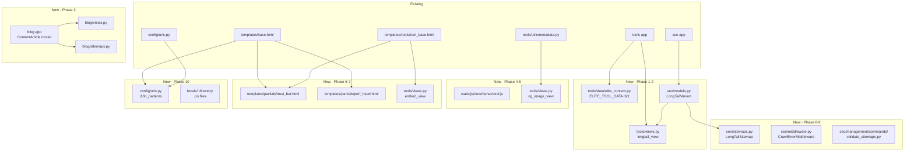

# Design Document: LamGen SEO Growth Dominance

## Overview

This design covers 10 phases of SEO and growth work on the existing Django 4.2 LamGen platform. The goal is to transform tool pages into elite content destinations, build scalable programmatic SEO, add behavioral engagement, maximize performance, and scaffold multi-language support — all without breaking the existing architecture or visual style.

---

## Architecture Overview



---

## Data Models

### Phase 1: Elite Content (static data, no DB)

`tools/data/elite_content.py` — a Python dict, no migration needed:

```python
ELITE_TOOL_DATA: dict[str, dict] = {
    "json-formatter": {
        "examples": [
            {"input": '{"a":1,"b":2}', "output": '{\n  "a": 1,\n  "b": 2\n}', "label": "Basic formatting"},
            {"input": '[1,2,{"x":true}]', "output": '[\n  1,\n  2,\n  {\n    "x": true\n  }\n]', "label": "Array with nested object"},
        ],
        "why_use": [
            "Instantly readable JSON with proper indentation",
            "Catches syntax errors before they reach production",
            "Zero-install, works in any browser",
        ],
        "common_mistakes": [
            {"mistake": "Trailing commas in JSON", "solution": "Remove trailing commas — JSON spec forbids them"},
            {"mistake": "Single-quoted strings", "solution": "Use double quotes — JSON requires double-quoted strings"},
        ],
        "how_it_works": [
            "Paste raw JSON into the input field",
            "The formatter parses and validates the JSON structure",
            "Output is displayed with configurable indentation",
            "Copy or download the formatted result",
        ],
        "comparison": [
            {"tool_slug": "json-validator", "differentiator": "Validator checks correctness only; formatter also beautifies"},
            {"tool_slug": "yaml-formatter", "differentiator": "YAML formatter for YAML syntax; JSON formatter for JSON"},
        ],
        "keyboard_shortcut": "Ctrl+Enter to format, Ctrl+Shift+C to copy output",
        "api_snippet": True,  # show Developer API section
    },
    # ... remaining 19 priority tools follow same structure
}
```

The top 20 priority tools are: json-formatter, image-compressor, word-counter, gpa-calculator, password-generator, qr-generator, uuid-generator, unit-converter, case-converter, pdf-merge, base64-encoder, hash-generator, markdown-previewer, regex-tester, css-formatter, js-formatter, color-converter, age-calculator, countdown-timer, url-encoder.

### Phase 2: LongTailVariant (DB model in `seo` app)

```python
class LongTailVariant(models.Model):
    INTENT_CHOICES = [
        ("online", "Online / Free"),
        ("use_case", "For Use Case"),
        ("without", "Without Limitation"),
        ("vs", "Comparison / VS"),
        ("how_to", "How To"),
        ("best", "Best / Top"),
    ]

    tool = models.ForeignKey("tools.Tool", on_delete=models.CASCADE, related_name="longtail_variants")
    variant_slug = models.SlugField(max_length=100)  # e.g. "for-api", "online", "without-signup"
    keyword_intent = models.CharField(max_length=20, choices=INTENT_CHOICES)
    unique_intro = models.TextField()
    meta_title = models.CharField(max_length=70)
    meta_description = models.CharField(max_length=160)
    canonical = models.CharField(max_length=300)  # always = tool.get_absolute_url()
    is_active = models.BooleanField(default=True)
    created_at = models.DateTimeField(auto_now_add=True)
    updated_at = models.DateTimeField(auto_now=True)

    class Meta:
        unique_together = ("tool", "variant_slug")

    def get_absolute_url(self):
        return reverse("tools:longtail", kwargs={
            "category_slug": self.tool.category.slug,
            "tool_slug": self.tool.slug,
            "variant_slug": self.variant_slug,
        })
```

### Phase 3: ContentArticle (new `blog` app)

```python
class ContentArticle(models.Model):
    CONTENT_TYPES = [
        ("tutorial", "Tutorial"),
        ("comparison", "Comparison"),
        ("use-case", "Use-Case Guide"),
        ("troubleshooting", "Troubleshooting Guide"),
    ]

    title = models.CharField(max_length=200)
    slug = models.SlugField(unique=True, max_length=250)
    content_type = models.CharField(max_length=20, choices=CONTENT_TYPES)
    body = models.TextField()  # Markdown
    related_tools = models.ManyToManyField("tools.Tool", blank=True, related_name="articles")
    author = models.CharField(max_length=100, default="LamGen Team")
    published_at = models.DateTimeField(null=True, blank=True)
    updated_at = models.DateTimeField(auto_now=True)
    meta_title = models.CharField(max_length=70, blank=True)
    meta_description = models.CharField(max_length=160, blank=True)
    is_published = models.BooleanField(default=False)

    def get_absolute_url(self):
        return reverse("blog:article", kwargs={
            "content_type": self.content_type,
            "slug": self.slug,
        })
```

---

## URL Structure

### New routes added to `tools/urls.py`

```
/tools/{category_slug}/{tool_slug}/{variant_slug}/   → longtail_view
/tools/{category_slug}/{tool_slug}/embed/            → embed_view
/og-image/{category_slug}/{tool_slug}.png            → og_image_view  (in config/urls.py)
```

### New `blog/urls.py`

```
/blog/                                               → blog_index
/blog/{content_type}/                                → blog_type_index
/blog/{content_type}/{slug}/                         → article_view
```

### Updated `config/urls.py`

```python
# Wrap existing patterns with i18n_patterns for non-default locales
# Add blog app
# Add og-image view
# Update robots_txt to disallow /api/ and /embed/
# Add LongTailSitemap and BlogSitemap to sitemaps dict
```

---

## Component Design

### Templates and Partials

**`templates/partials/trust_bar.html`** — 6 trust signals, included above fold in `tool_base.html`:
```html
<div class="trust-bar" role="complementary" aria-label="Trust signals">
  <span class="trust-item"><i class="bi bi-cpu"></i> </span>
  <span class="trust-item"><i class="bi bi-person-x"></i> </span>
  <span class="trust-item"><i class="bi bi-shield-lock"></i> </span>
  <span class="trust-item"><i class="bi bi-gift"></i> </span>
  <span class="trust-item"><i class="bi bi-lightning-charge"></i> </span>
  <span class="trust-item"><i class="bi bi-database-x"></i> </span>
</div>
```

**`templates/partials/perf_head.html`** — preload/prefetch tags injected into `base.html` `<head>`:
```html

<link rel="preload" href="" as="style">


{# Override in tool pages to add related tool prefetches #}

```

**`templates/partials/privacy_badge.html`** — small badge with tooltip:
```html
<span class="privacy-badge" data-tooltip="">
  <i class="bi bi-shield-check"></i>
</span>
```

**`templates/tools/tool_base.html` additions:**
- Include `trust_bar.html` immediately after `<article class="tool-page">` open tag (above fold)
- Add `` block after `tool-canvas` for examples, why-use, mistakes, comparison sections
- Add embed modal HTML at bottom of article
- Add `` with 3 prefetch links (related tools + category)
- Add `` override pointing to `og_image_view`
- Add `hreflang x-default` link in ``

**`templates/blog/article.html`** — extends `base.html`:
- Article JSON-LD schema in ``
- Inline tool card partial: ``
- Related articles section at bottom

**`templates/tools/embed.html`** — minimal standalone template (no nav/dock):
- Just the `tool-canvas` section
- Minimal CSS inline
- No external JS except the tool's own JS file

### JavaScript Modules

**`static/js/core/behavioral.js`** — localStorage tracker:
```javascript
const BehavioralTracker = {
  RECENT_KEY: 'lamgen_recent_tools',
  MAX_RECENT: 10,

  recordVisit(slug) { /* push to recent, cap at 10, increment visits_{slug} */ },
  recordAction(slug, action) { /* increment lamgen_tool_stats_{slug}[action] */ },
  trackDwell(slug) { /* record start time, write on pagehide/visibilitychange */ },
  getRecent() { /* return array from localStorage */ },
  getStats(slug) { /* return {copy, download, share, visits, dwell} */ },
};
```

Loaded via `defer` on all tool pages. Homepage reads from it to populate Recently Used and Most Used sections.

**`static/js/core/share-state.js`** — permalink state encoding:
```javascript
// encode: serialize tool input state to base64 URL param ?s=<encoded>
// decode: on page load, if ?s= present, restore input state and auto-run
function encodeState(stateObj) { return btoa(JSON.stringify(stateObj)); }
function decodeState(encoded) { return JSON.parse(atob(encoded)); }
```

### Views

**`longtail_view`** in `tools/views.py`:
- Looks up `LongTailVariant` by `(tool_slug, variant_slug)` — 404 if not found
- Renders `tools/tool_base.html` with variant's unique_intro, meta_title, meta_description
- Sets canonical to `tool.get_absolute_url()`
- Passes same `tool`, `category`, `related_tools`, `seo_faq_items` as `tool_view`

**`embed_view`** in `tools/views.py`:
- Renders `tools/embed.html` — minimal template
- Sets `X-Frame-Options: ALLOWALL` (or remove the header for embed URLs)

**`og_image_view`** in `tools/views.py`:
- Checks `media/og/{category_slug}/{tool_slug}.png` — return cached file if exists
- Otherwise generates with Pillow: 1200×630 canvas, dark background, tool name text, icon text, LamGen branding
- Saves to `media/og/` and returns as `image/png`
- Cache-Control: `public, max-age=86400`

```python
def og_image_view(request, category_slug, tool_slug):
    tool = get_object_or_404(Tool, slug=tool_slug, category__slug=category_slug, is_active=True)
    cache_path = Path(settings.MEDIA_ROOT) / "og" / category_slug / f"{tool_slug}.png"
    if cache_path.exists():
        return FileResponse(open(cache_path, "rb"), content_type="image/png")
    img = generate_og_image(tool)  # Pillow: 1200x630
    cache_path.parent.mkdir(parents=True, exist_ok=True)
    img.save(cache_path, "PNG")
    buf = BytesIO(); img.save(buf, "PNG"); buf.seek(0)
    return HttpResponse(buf, content_type="image/png",
                        headers={"Cache-Control": "public, max-age=86400"})
```

### Sitemaps

**`seo/sitemaps.py`** additions:
```python
class LongTailSitemap(Sitemap):
    priority = 0.65
    changefreq = "monthly"
    def items(self): return LongTailVariant.objects.filter(is_active=True).select_related("tool__category")
    def lastmod(self, obj): return obj.updated_at
    def location(self, obj): return obj.get_absolute_url()

```

**`blog/sitemaps.py`**:
```python
class BlogSitemap(Sitemap):
    priority = 0.70
    changefreq = "weekly"
    def items(self): return ContentArticle.objects.filter(is_published=True)
    def lastmod(self, obj): return obj.updated_at
    def location(self, obj): return obj.get_absolute_url()
```

### Management Command

**`seo/management/commands/validate_sitemaps.py`**:
- Reads all sitemap URLs from the sitemap index
- Makes HTTP GET to each URL
- Reports failures (non-200) to stdout
- Exit code 1 if any failures

### Middleware

**`seo/middleware.py` — `CrawlErrorMiddleware`**:
- Checks `response.status_code == 404`
- Checks `request.path` starts with `/tools/` or `/content/` or `/blog/`
- Appends to `logs/crawl_errors.log`: `{timestamp} 404 {path} {referer}`

---

## Integration Points

### `tool_view` changes (existing view in `tools/views.py`)
- Load `ELITE_TOOL_DATA.get(tool.slug, {})` and pass to context as `elite`
- Pass `elite` to template for conditional rendering of examples, why-use, mistakes, comparison blocks
- Override `` to point to `og_image_view` URL

### `base.html` changes
- Add `` in `<head>`
- Add `hreflang x-default` link: `<link rel="alternate" hreflang="x-default" href="{{ request.build_absolute_uri }}">`
- Add `og:locale` tag: `<meta property="og:locale" content="{{ LANGUAGE_CODE|default:'en' }}_{{ LANGUAGE_CODE|upper|default:'EN' }}">`
- Change `<html lang="en">` to `<html lang="{{ LANGUAGE_CODE|default:'en' }}" dir="rtl">`
- Add `` and wrap key UI strings with ``

### `config/urls.py` changes
- Wrap tool/blog/seo URL includes with `i18n_patterns`
- Add `og-image` URL pattern
- Add `blog` app include
- Update `robots_txt` to disallow `/api/` and `/embed/`
- Add `longtail` and `blog` sitemaps to `sitemaps` dict

### `config/settings.py` additions
```python
LANGUAGES = [
    ("en", "English"),
    ("bn", "Bengali"),
    ("hi", "Hindi"),
    ("es", "Spanish"),
    ("ar", "Arabic"),
]
LOCALE_PATHS = [BASE_DIR / "locale"]
INSTALLED_APPS += ["blog"]
MIDDLEWARE += ["seo.middleware.CrawlErrorMiddleware"]
```

---

## Performance Strategy

### Critical CSS Inlining
- Extract above-fold styles from `main.css` into `templates/partials/critical_css.html`
- Include inline in `<head>` of `tool_base.html` via ``
- Load full `main.css` non-blocking: `<link rel="stylesheet" href="..." media="print" onload="this.media='all'">`

### Preload / Prefetch
- `perf_head.html` preloads: `main.css`, Google Fonts CSS
- `tool_base.html` overrides `` with 3 prefetch links:
  1. Category page URL
  2. First related tool URL
  3. Homepage URL

### Image Lazy Loading
- All `` tags below the fold get `loading="lazy"` attribute
- OG images served with `Cache-Control: public, max-age=86400`

### Static Assets
- Already handled: `WHITENOISE_MAX_AGE=31536000`, `CompressedManifestStaticFilesStorage`
- Content-hashed filenames ensure `Cache-Control: immutable` behavior

### JS Deferral
- All `<script>` tags in `<head>` already use `media="print"` pattern or `defer`
- `behavioral.js` and `share-state.js` loaded with `defer`
- Per-tool JS files loaded at bottom of `tool_base.html` with `defer`

---

## i18n Architecture

```
config/urls.py:
  urlpatterns = [
      path("robots.txt", robots_txt),
      path("sitemap.xml", ...),
      path("og-image/...", og_image_view),
  ] + i18n_patterns(
      path("", include("tools.urls", namespace="tools")),
      path("content/", include("seo.urls", namespace="seo")),
      path("blog/", include("blog.urls", namespace="blog")),
      prefix_default_language=False,  # /tools/ stays as-is for English
  )

locale/
  en/LC_MESSAGES/django.po   (source strings)
  bn/LC_MESSAGES/django.po   (empty scaffold)
  hi/LC_MESSAGES/django.po   (empty scaffold)
  es/LC_MESSAGES/django.po   (empty scaffold)
  ar/LC_MESSAGES/django.po   (empty scaffold)
```

- `prefix_default_language=False` keeps English URLs unchanged (no `/en/` prefix)
- Bengali: `/bn/tools/`, Hindi: `/hi/tools/`, Spanish: `/es/tools/`, Arabic: `/ar/tools/`
- RTL: `<html dir="rtl">` applied via template tag when `LANGUAGE_CODE == 'ar'`
- Fallback: Django's default `USE_I18N=True` with `LANGUAGE_CODE='en-us'` handles missing translations transparently
- Adding a new language: add to `LANGUAGES`, run `makemessages -l {code}`, provide `.po` file — no schema changes

---

## Error Handling

- `longtail_view`: `get_object_or_404(LongTailVariant, tool__slug=tool_slug, variant_slug=variant_slug, is_active=True)` — returns 404 for unknown variants
- `og_image_view`: `get_object_or_404(Tool, ...)` — 404 for unknown tools; Pillow errors caught and fallback to default OG image
- `embed_view`: same 404 handling as `tool_view`
- `CrawlErrorMiddleware`: only logs, never raises — wrapped in try/except to avoid breaking responses
- `validate_sitemaps` command: catches connection errors per URL, reports all failures before exiting

---

## Correctness Properties

*A property is a characteristic or behavior that should hold true across all valid executions of a system — essentially, a formal statement about what the system should do. Properties serve as the bridge between human-readable specifications and machine-verifiable correctness guarantees.*

### Property 1: Elite content data completeness

*For any* tool slug in the top-20 priority list, `ELITE_TOOL_DATA[slug]` shall contain at least 2 examples, at least 3 why-use statements, at least 2 common-mistake pairs, and at least 3 how-it-works steps.

**Validates: Requirements 1.1, 1.2, 1.3, 1.4**

### Property 2: Cluster tools have comparison data

*For any* tool slug that appears as a key in `_TOPICAL_CLUSTERS`, `ELITE_TOOL_DATA[slug]['comparison']` shall contain at least 2 entries.

**Validates: Requirements 1.5**

### Property 3: LongTail variant uniqueness

*For any* two distinct `LongTailVariant` instances, their `(meta_title, meta_description, unique_intro)` tuples shall be pairwise distinct — no two variants share identical title, description, or intro.

**Validates: Requirements 3.2**

### Property 4: LongTail canonical correctness

*For any* `LongTailVariant`, the `canonical` field shall equal `variant.tool.get_absolute_url()`.

**Validates: Requirements 3.3**

### Property 5: Unknown variant returns 404

*For any* request to `/tools/{cat}/{slug}/{variant}/` where no matching `LongTailVariant` exists, the response status shall be 404.

**Validates: Requirements 3.6**

### Property 6: Article URL pattern

*For any* `ContentArticle`, `get_absolute_url()` shall match the regex `^/blog/[a-z-]+/[a-z0-9-]+/$`.

**Validates: Requirements 4.4**

### Property 7: Article schema completeness

*For any* `ContentArticle`, `build_article_schema(article, request)` shall return a dict containing non-empty values for `datePublished`, `dateModified`, `author`, and `headline`.

**Validates: Requirements 4.3**

### Property 8: Published articles have related tools

*For any* published `ContentArticle` (is_published=True), `related_tools.count()` shall be >= 1.

**Validates: Requirements 4.2**

### Property 9: Behavioral tracker recent tools cap

*For any* sequence of N tool slug visits (N > 10), `lamgen_recent_tools` in localStorage shall contain exactly 10 slugs, being the last 10 visited in reverse-chronological order.

**Validates: Requirements 5.1**

### Property 10: Behavioral tracker action counts

*For any* tool slug and action type (copy/download/share), performing the action N times shall result in `lamgen_tool_stats_{slug}[action]` equaling N.

**Validates: Requirements 5.2**

### Property 11: Trending tools ordering

*For any* set of tools with varying `view_count` values, the trending section shall display exactly the top min(count, 8) tools ordered by `view_count` descending.

**Validates: Requirements 5.4**

### Property 12: Trust bar contains all 6 signals

*For any* tool page render, the rendered HTML shall contain all 6 trust signal strings: "Runs entirely in your browser", "No signup required", "Privacy-first", "Free forever", "Instant processing", "No data stored".

**Validates: Requirements 2.6, 7.1**

### Property 13: Prefetch links present on tool pages

*For any* tool page, the rendered `<head>` shall contain exactly 3 `<link rel="prefetch">` tags.

**Validates: Requirements 6.7**

### Property 14: Embed URL pattern

*For any* active `Tool`, the embed URL shall match `/tools/{category_slug}/{tool_slug}/embed/` and return HTTP 200.

**Validates: Requirements 8.1, 8.3**

### Property 15: Share state round-trip

*For any* tool input state dict (containing string keys and string/number values), `decodeState(encodeState(state))` shall produce a dict equal to the original state.

**Validates: Requirements 8.4, 8.7**

### Property 16: OG image dimensions

*For any* active `Tool`, `og_image_view` shall return a PNG image with width=1200 and height=630.

**Validates: Requirements 9.1**

### Property 17: OG meta tags completeness

*For any* tool page, the rendered HTML head shall contain all of: `og:title`, `og:description`, `og:image`, `og:url`, `og:type`, `og:site_name`, `twitter:card`, `twitter:title`, `twitter:description`, `twitter:image`.

**Validates: Requirements 9.2, 9.3**

### Property 18: OG tags within first 4KB

*For any* tool page HTTP response, all OG meta tags shall appear within the first 4096 bytes of the response body.

**Validates: Requirements 9.6**

### Property 19: Sitemap lastmod present

*For any* `Tool`, `LongTailVariant`, or `ContentArticle`, its sitemap entry shall have a non-null `lastmod` value derived from `updated_at`.

**Validates: Requirements 10.2**

### Property 20: Sitemap priority correctness

*For any* `Tool`, its sitemap priority shall be 0.95 if `is_featured=True`, 0.80 otherwise (for standard tools with view_count <= 1000).

**Validates: Requirements 10.3**

### Property 21: Canonical tag present

*For any* tool page, category page, or longtail page, the rendered `<head>` shall contain exactly one `<link rel="canonical">` tag.

**Validates: Requirements 10.5**

### Property 22: hreflang x-default present

*For any* page, the rendered `<head>` shall contain a `<link rel="alternate" hreflang="x-default">` tag.

**Validates: Requirements 10.8**

### Property 23: Required languages configured

*For any* language code in `{"en", "bn", "hi", "es", "ar"}`, `settings.LANGUAGES` shall contain an entry with that code.

**Validates: Requirements 11.2**

### Property 24: Locale .po files exist

*For any* language code in `{"bn", "hi", "es", "ar"}`, the file `locale/{lang}/LC_MESSAGES/django.po` shall exist on disk.

**Validates: Requirements 11.4**

### Property 25: RTL applied for Arabic

*For any* page rendered with `LANGUAGE_CODE='ar'`, the `<html>` element shall have `dir="rtl"` attribute.

**Validates: Requirements 11.6**

---

## Testing Strategy

### Unit Tests (example-based)

- `test_elite_content.py` — verify ELITE_TOOL_DATA structure for each priority tool
- `test_longtail_views.py` — 404 for unknown variants, 200 for known variants, canonical header
- `test_blog_views.py` — article rendering, tool card inline, related articles
- `test_og_image.py` — image generation, caching behavior, 404 for unknown tools
- `test_robots_txt.py` — verify all 4 disallow paths present
- `test_sitemap.py` — verify 6 sitemap sections in index
- `test_crawl_middleware.py` — 404 on tool URL writes to log file
- `test_embed_view.py` — embed URL returns 200, no nav elements in response

### Property-Based Tests (Hypothesis)

Using `hypothesis` (already present via `.hypothesis/` directory in repo).

Each property test runs minimum 100 iterations. Tag format: `Feature: lamgen-seo-growth-dominance, Property {N}: {text}`

```python
# Example property test structure
from hypothesis import given, settings
from hypothesis import strategies as st

@given(st.sampled_from(PRIORITY_TOOL_SLUGS))
@settings(max_examples=100)
def test_property_1_elite_content_completeness(slug):
    """Feature: lamgen-seo-growth-dominance, Property 1: Elite content data completeness"""
    data = ELITE_TOOL_DATA[slug]
    assert len(data["examples"]) >= 2
    assert len(data["why_use"]) >= 3
    assert len(data["common_mistakes"]) >= 2
    assert len(data["how_it_works"]) >= 3
```

Properties 3, 9, 10, 11, 15 are the highest-value property tests — they cover uniqueness invariants, behavioral tracker correctness, and the share state round-trip.

### Integration Tests

- Sitemap index returns 200 and contains all 6 section URLs
- `validate_sitemaps` management command runs without error on test DB
- OG image view returns correct Content-Type and dimensions
- i18n URL routing: `/bn/tools/` returns 200 with Bengali language active
